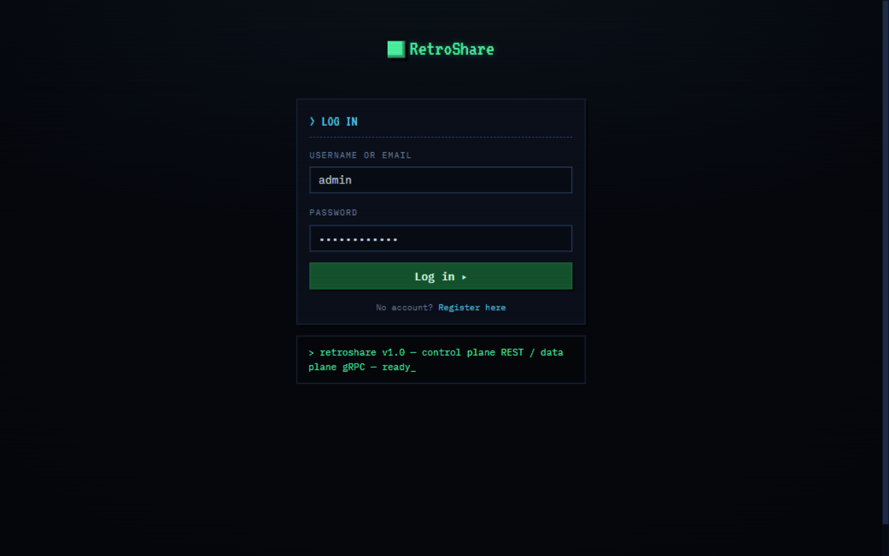
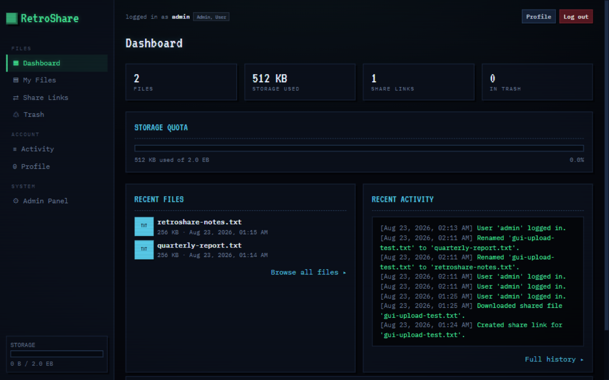
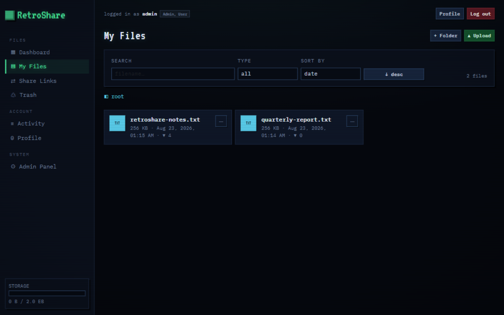
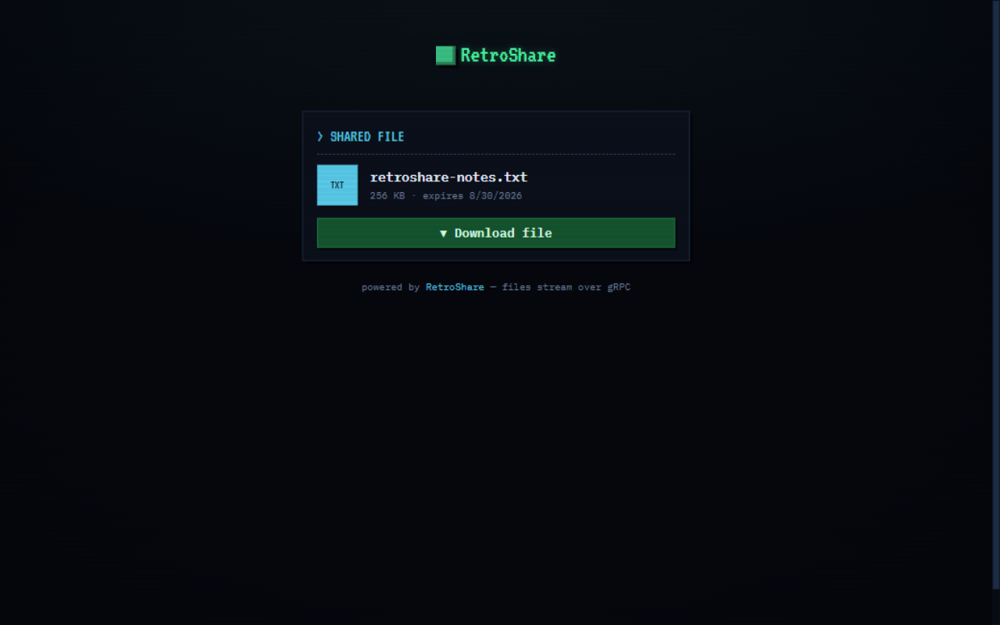
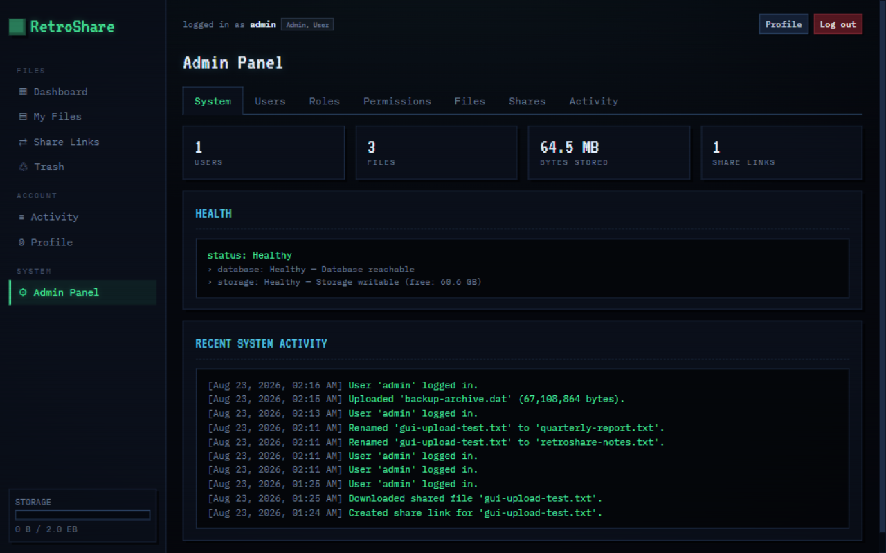

# RetroShare

**A modern file-sharing platform with a retro soul.** Streaming uploads over gRPC,
expiring password-protected share links, storage quotas, a full role &amp; permission
engine, and a CRT-inspired interface — built with ASP.NET Core, EF Core + SQLite,
Bootstrap and vanilla JavaScript.

```
██▄ ▄██ ▄▄▄▄▄  ▄██▄  ▄▄▄ ▄ ▄▄   ▄▄▄▄  ▄▄▄                    ▄▄
███ ▀██ ▀▀███  ▀███  █▄▄▄█ ▀▄█▀▄█ ▄▄▄█▀ █▄▄▀ ▄▄▄ ▄▄▄▄▄  ▄▄▄▄▄  █▄▄█ ▄▄▄ ▄▄▄
███▄▄▀█ ▄▄███  ▄███▄ █▄▄▄█  ██▀█ ▀█▄▄▄  █  █ █▄▄█ ▀▀█▀▀ ▀▀███  █▄▄▀ ██▄▄█▀▀█
▀▀▀▀▀▀▀ ▀▀▀▀▀▀ ▀▀▀▀▀▀ ▀▀▀▀▀▀ ▀▀   ▀ ▀▀▀▀▀▀ ▀▀▀  ▀▀▀   ▀▀   ▀▀▀▀▀▀ ▀▀▀  ▀▀▀▀▀▀
```

## Screenshots

> To be added with the published release. Drop files into `docs/screenshots/`
> and uncomment the embeds below.

### Login
<!--  -->

### Dashboard
<!--  -->

### File manager
<!--  -->

### Share page
<!--  -->

### Admin panel
<!--  -->

## Features

- **Accounts & sessions** — registration, login, short-lived JWT access tokens,
  rotating + revocable refresh tokens, PBKDF2 password hashing, rate-limited auth.
- **Files** — upload/download/rename/move/search/sort/filter, details, trash with
  restore, permanent delete. Uploads and downloads stream over **gRPC** (with
  gRPC-Web for the browser) in 64 KB chunks — large files never buffer in memory.
- **Folders** — per-owner trees with breadcrumbs, cycle-safe moves, recursive soft
  delete that trashes contained files.
- **Sharing** — public links (`/s/{token}`) with expiration, optional passwords,
  download limits, enable/disable and revocation. Cryptographically random tokens.
- **Quotas** — per-user storage quotas enforced server-side, with usage meters in
  the UI.
- **Dashboard** — file/storage/share statistics, quota bar, recent files and a
  terminal-style activity feed.
- **Admin panel** — manage users (disable, reassign roles, quotas, delete),
  roles &amp; permissions (create custom roles live), moderate all files and share
  links, system health.
- **Activity log** — auditable trail of every important action.
- **Retro UI** — monospace/pixel CRT aesthetic on Bootstrap 5, fully responsive
  from 360 px to 1920 px, no frontend framework.

## Architecture

```
┌──────────────────────┐      REST (JSON)       ┌─────────────────────────┐
│  RetroShare.Web      │ ─────────────────────► │  RetroShare.API          │
│  (HTML/JS/CSS)       │ ◄───────────────────── │  Controllers, policies,  │
└─────────┬────────────┘                        │  middleware, health      │
          │ gRPC-Web (streaming)                └───────────┬─────────────┘
          ▼                                                 │
┌──────────────────────┐   chunks    ┌──────────────────────▼─────────────┐
│  FileTransfer gRPC   │ ◄─────────► │  RetroShare.Application            │
│  Upload / Download   │             │  Services, DTOs, validation        │
└──────────────────────┘             └───────────┬────────────────────────┘
             Data plane                           │  Control plane
                                                  ▼
                                    ┌─────────────────────────────────┐
                                    │  RetroShare.Infrastructure      │
                                    │  EF Core + SQLite, repos, JWT,  │
                                    │  local blob storage             │
                                    └─────────────────────────────────┘
```

- **Control plane** — REST over `ApiController`s: auth, users, files/folders
  metadata, sharing, admin, dashboard. DTOs only, never EF entities.
- **Data plane** — a dedicated gRPC `FileTransfer` service (`Upload` client-streaming,
  `Download` server-streaming). Enabled for gRPC-Web so the vanilla-JS frontend
  speaks it directly with a tiny hand-rolled protobuf codec (`assets/js/grpc.js`).

### Projects

| Project | Responsibility |
| --- | --- |
| `src/RetroShare.Domain` | Entities, enums, constants (permissions catalog) |
| `src/RetroShare.Application` | Business services, DTOs, interfaces, validators |
| `src/RetroShare.Infrastructure` | EF Core/SQLite, repositories, JWT, storage, gRPC implementation, seeding |
| `src/RetroShare.API` | Hosting, controllers, middleware, Swagger, health checks |
| `src/RetroShare.Web` | Static retro frontend served by the API |

## Technology stack

ASP.NET Core 9 · C# · EF Core 9 + SQLite (migrations) · JWT + refresh tokens ·
gRPC + gRPC-Web · Serilog · Swashbuckle · xUnit · Bootstrap 5 + vanilla JavaScript
(ES modules, no build step)

## Database overview

Nine tables with indexes on hot paths: `Users`, `Roles`, `Permissions`,
`UserRoles`, `RolePermissions`, `RefreshTokens` (unique token-hash index),
`Files` (owner/name/folder/deleted indexes), `Folders` (owner+parent), `Shares`
(unique token, expiry), `ActivityLogs` (timestamps, action, user).

Migrations live in `src/RetroShare.Infrastructure/Data/Migrations` and are applied
automatically at startup, followed by idempotent seeding (permission catalog, the
three system roles, bootstrap admin).

## Authentication architecture

- Passwords: PBKDF2-SHA256, 100k iterations, per-hash salt, versioned format.
- Access tokens: 15-minute HS256 JWTs carrying `sub`, `username`, `role` and `perm`
  claims (mirrored for display; enforcement always re-checks the database).
- Refresh tokens: 64 random bytes, only a SHA-256 hash is stored; rotated on every
  refresh (the old token is revoked and linked to its replacement); revocable per
  token (logout) or per user (password change / account disable).
- Login timing is equalized for unknown users to avoid trivial enumeration.

## Authorization architecture

Roles are pure permission groups; permissions are rows in the database:

```
User ──< UserRole >── Role ──< RolePermission >── Permission
```

- Every permission in `Domain/Constants/Permissions.cs` becomes an ASP.NET Core
  policy: `[Authorize(Policy = Permissions.FilesUpload)]` — controllers never
  hard-code role names.
- A scoped `PermissionAuthorizationHandler` resolves the caller's effective
  permission set from the database (30 s micro-cache with explicit invalidation),
  so role/permission changes apply **immediately**, without re-issuing tokens.
- Custom roles can be created at runtime from the admin UI.
- The only system-level guards: system roles can't be renamed/deleted, and the
  seeded Admin role must keep `system.manage` so an instance can't lock itself out.

## gRPC architecture

`Protos/file_transfer.proto` defines `FileTransfer`:

- `rpc Upload (stream UploadRequest) returns (UploadResponse)` — first message
  carries init metadata (name, declared size, MIME, folder); the rest are raw
  chunks. The server pre-validates name/extension/MIME/quota, streams chunks to
  disk, and commits the metadata only when the byte count matches the declaration
  (otherwise the partial upload is discarded).
- `rpc Download (DownloadRequest) returns (stream DownloadResponse)` — first
  message carries metadata; the rest are 64 KB chunks. Authorized either by JWT
  (owner/admin, requires `files.download`) or by a share token + optional password
  (anonymous; the share's download counter increments atomically before streaming).
- The API host maps the service with gRPC-Web enabled, so the browser streams via
  `fetch` with a ~200-line protobuf codec — no npm toolchain anywhere.

## API overview

Swagger UI runs at `/swagger` in development. Highlights:

```
POST   /api/auth/register|login|refresh|logout      GET /api/auth/me
GET    /api/files?search=&type=&sort=&trash=        GET /api/files/{id}
PUT    /api/files/{id} (rename)                     POST /api/files/{id}/move|restore
DELETE /api/files/{id}?permanent=                   GET /api/files/all (admin)
GET    /api/folders · POST /api/folders · PUT /api/folders/{id}
POST   /api/folders/{id}/move · DELETE /api/folders/{id} · GET /api/folders/contents
POST   /api/files/{id}/share · GET /api/shares · GET /api/shares/all
GET    /api/shares/{token} (public) · DELETE /api/shares/{id} (revoke)
GET    /api/trash · POST /api/trash/{id}/restore · DELETE /api/trash/{id}
GET    /api/users · PUT /api/users/{id}(/roles) · DELETE /api/users/{id}
GET    /api/roles · POST /api/roles · PUT /api/roles/{id} · DELETE /api/roles/{id}
GET    /api/permissions · GET /api/dashboard(/admin) · GET /api/activity(/all)
GET    /api/health
```

Errors use a consistent envelope: `{"success":false,"message":"…","code":"FILE_NOT_FOUND"}`.

## Setup

### Requirements

- [.NET SDK 9](https://dotnet.microsoft.com/download/dotnet/9.0)
- Any modern browser

### Run from source

```bash
dotnet restore
dotnet run --project src/RetroShare.API
# → http://localhost:5000  (Swagger at /swagger in Development)
```

First start creates `retroshare.db`, applies migrations, seeds permissions/roles and
the bootstrap administrator.

**Development seed credentials** — development only, never use in production:

- Username: `admin`
- Password: `ChangeMe!123`

Production deployments require explicit secrets (see the configuration table and
`.env.example`) and **refuse to boot** with these seed values.

### Configuration

Everything is environment-variable overridable (`Section__Key`):

| Setting | Default | Meaning |
| --- | --- | --- |
| `Jwt:Secret` | none (dev value in `appsettings.Development.json`) | ≥32-byte signing secret (**required in production**; known dev placeholders are rejected) |
| `Jwt:AccessTokenMinutes` / `RefreshTokenDays` | 15 / 7 | Token lifetimes |
| `ConnectionStrings:Database` | `Data Source=retroshare.db` | SQLite connection |
| `Storage:Root` | `storage` | Blob directory (per-user/per-file layout) |
| `Storage:MaxFileSizeBytes` | 2 GiB | Single-file cap |
| `Storage:DefaultUserQuotaBytes` | 10 GiB | Quota for new users |
| `Seed:Admin*` | see `.env.example` | Bootstrap administrator |
| `Cors:AllowedOrigins` | empty (same-origin) | Extra allowed origins |
| `ForwardedHeaders:Enabled` | `false` | Honor `X-Forwarded-*` behind a reverse proxy |
| `ForwardedHeaders:KnownProxies` | loopback | Proxy IPs trusted to set forwarded headers |

## Security notes

- **No secrets in source.** The base configuration carries no signing key; a
  development-only secret lives in `appsettings.Development.json`. Production
  requires `Jwt__Secret` (≥32 bytes) and rejects the known repository
  placeholders outright.
- **Passwords are never stored.** PBKDF2-SHA256 with per-hash salt; refresh
  tokens are stored as SHA-256 hashes only and rotate on every use.
- **Every file operation is authorized server-side** — ownership checks,
  permission policies resolved live from the database, backend-enforced quotas,
  filename sanitization, blocked extension/MIME lists, and path-traversal-safe
  storage paths.
- **Share links use 128-bit cryptographically random tokens**, with server-side
  expiry, optional passwords (hashed), download limits and revocation.
- **Rate limiting** on all endpoints (stricter on auth), safe error envelopes
  that never leak stack traces, hashes or internal paths, and an auditable
  activity log.

## Docker

```bash
cp .env.example .env        # set JWT_SECRET + ADMIN_PASSWORD
docker compose up --build   # → http://localhost:8080
```

The image builds, **runs the test suite as part of the build**, publishes the app
and stores database + blobs under the `retroshare-data` volume.

## Development

```bash
dotnet build RetroShare.sln
dotnet test RetroShare.sln          # 93 tests: unit + full-stack integration
dotnet watch run --project src/RetroShare.API
```

Integration tests boot the entire app (REST + gRPC + frontend) on an in-memory
SQLite database via `WebApplicationFactory`, including real streamed gRPC
upload/download round-trips and permission/ownership attack scenarios.

## Testing

| Suite | Covers |
| --- | --- |
| `RetroShare.UnitTests` (61) | password hashing, token generation, share expiration/limits, name sanitization &amp; reserved names, blocked extensions/MIMEs, storage path-traversal protection, read/write round-trip |
| `RetroShare.IntegrationTests` (32) | auth flows (register/login/refresh rotation/logout), permission enforcement incl. live role changes, gRPC upload/download round-trips, ownership isolation, quota enforcement, share lifecycle (password/expiry/limit/revoke), folder tree operations, user deletion cascades, dashboards, health |

## Future improvements

- Range/resumable downloads (gRPC offset window)
- Background virus scanning hook for completed uploads
- Email verification and password reset tokens
- Per-folder sharing (currently single-file links)
- Blob checksums (SHA-256) surfaced in the UI
- Prometheus metrics endpoint alongside the health checks

## Release notes

- [v1.0.0](docs/RELEASE-v1.0.0.md) — first stable release

## License

[MIT](LICENSE)
